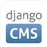
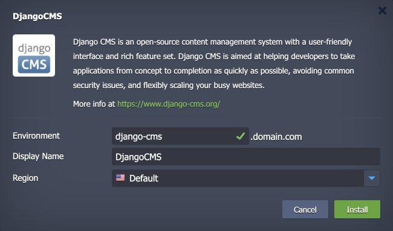

 

# Django CMS

The package deploys the [Django CMS](https://www.django-cms.org/) solution - a powerful and flexible content management system (CMS) built on the open-source Python-based Django framework. With its modular architecture, Django CMS allows for easy customization and extension, making it a developer- and user-friendly solution suitable for a wide range of web projects.

## Environment Topology

This package creates a dedicated Django CMS environment that contains one dedicated Python-based application server container. It automatically deploys and sets the Django CMS application. The automatic vertical scaling is enabled out of the box, and [horizontal scaling](https://www.virtuozzo.com/application-platform-docs/automatic-horizontal-scaling/) can be configured (if needed). The default software stacks utilized in the package are the following:

- Apache 2 Python application server (Python 3.12)
- Django 5.1.4
- Django CMS 4.1.4

## Deployment to Cloud

To get your Django CMS solution, click the "**Deploy to Cloud**" button below, specify your email address within the widget, choose one of the [Virtuozzo Public Cloud Providers](https://www.virtuozzo.com/application-platform-partners/), and confirm by clicking **Install**.

> If you already have a Virtuozzo Application Platform (VAP) account, you can deploy this solution from the [Marketplace](https://www.virtuozzo.com/application-platform-docs/marketplace/) or [import](https://www.virtuozzo.com/application-platform-docs/environment-import/) a manifest file from this repository.

## Installation Process

In the opened installation window at the VAP dashboard, provide a preferred environment and display names, choose a region (if available), and confirm the installation.

Your Django CMS application will be automatically installed in a few minutes.

More information can be found in the **[Django CMS Installation to the Cloud](https://www.virtuozzo.com/company/blog/django-cms-installation-python-cloud-hosting/)** article.
