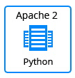

## DjangoCMS

The JPS package deploys [DjangoCMS](http://django-cms.org/) that initially contains 1 application server.

### Highlights
This package is designed to deploy DjangoCMS environment which represents an open source content management system.
DjangoCMS is an open source content management system based on the Web framework Django that encourages rapid development and clean, pragmatic design.
  - **Ridiculously fast.**
    Django was designed to help developers take applications from concept to completion as quickly as possible.
  - **Reassuringly secure.**
    Django takes security seriously and helps developers avoid many common security mistakes.
  - **Exceedingly scalable.**
    Some of the busiest sites on the Web leverage Django’s ability to quickly and flexibly scale.

### Environment Topology

### Specifics

Layer                |     Server    | Number of CTs   by default | Cloudlets per CT   (reserved/dynamic) | Options
-------------------- | --------------| :----------------------------: | :---------------------------------------: | :-----:
AS                   | Apache 2 (PYTHON) |       1                        |           1 / 16                          | -

* AS - Application server 
* DB - Database 
* CT - Container

**DjangoCMS Version**: 1.8.5 
**Python Engine**: Python 2.7

### Deployment

In order to get this solution instantly deployed, click the "Get It Hosted Now" button, specify your email address within the widget, choose one of the [Jelastic Public Cloud providers](https://jelastic.cloud) and press Install.

To deploy this package to Jelastic Private Cloud, import [this JPS manifest](../../raw/master/manifest.jps) within your dashboard ([detailed instruction](https://docs.jelastic.com/environment-export-import#import)).

More information about Jelastic JPS package and about installation widget for your website can be found in the [Jelastic JPS Application Package](https://github.com/jelastic-jps/jpswiki/wiki/Jelastic-JPS-Application-Package) reference.
