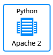
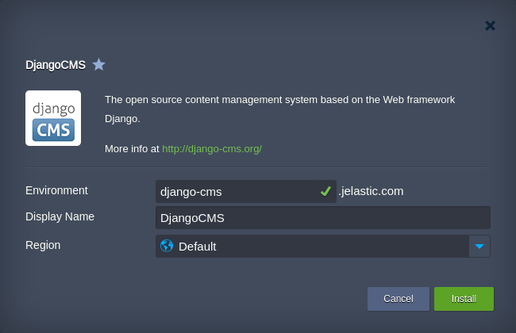

 

## Django CMS One-Click Deploy

**Django CMS** is an open-source content management system with user-friendly interface and rich feature set built for needs of multilingual publishing. Django CMS is aimed at helping developers to take applications from concept to completion as quickly as possible, avoiding common security issues, and flexibly scaling your busy websites.

### Environment Topology

The JPS package creates a Python-based environment, which contains a MySQL Server, Apache application server and deploys the Django CMS software from the web.   
The version to be installed on a choice in the install between <strong>Stable</strong> and <strong>LTS</strong>, currently equal on both releases.
<table border="0"><tr><td>
  
  </td><td>
<strong>Stable</strong>     
<strong>Django Version: 2.2.9</strong>     
<strong>Django CMS Version: 3.7.1</strong>     
<strong>Python Engine: Python 3.7.5</strong>      
  </td><td>
<strong>LTS</strong>     
<strong>Django Version: 2.2.9</strong>     
<strong>Django CMS Version: 3.7.1</strong>     
<strong>Python Engine: Python 3.7.5</strong>      
  </td></tr></table>

### Deployment to the Cloud

In order to get this solution instantly deployed, click the **Get It Hosted Now** button below, specify the required information within the opened page, choose one of the [Jelastic Public Cloud providers](https://jelastic.cloud) and click **Install**.

**Note**: If you are already registered at Jelastic, you can deploy this cluster by importing the [package manifest raw link](https://raw.githubusercontent.com/jelastic-jps/django-cms/master/manifest.jps) within the dashboard.

In the opened confirmation window at Jelastic dashboard, just specify the environment name and the region if several are available, click **Install** and wait for the process to be automatically completed.

 

More information can be found in the article [Django CMS Installation to the Cloud](https://jelastic.com/blog/django-cms-installation-python-cloud-hosting).
